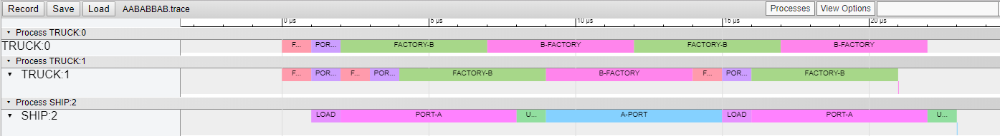
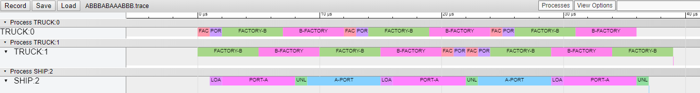

# TransportTycoon

Transport Tycoon Exercises for DDD

## Task

| Input        | Ex. 1 | Ex. 2 |
| ------------ | ----- | ----- |
| A            | 5     | 9     |
| AB           | 5     | 9     |
| BB           | 5     | 5     |
| ABB          | 7     | 9     |
| AABABBAB     | 29    | 23    |
| ABBBABAAABBB | 41    | 39    |

## Trace

